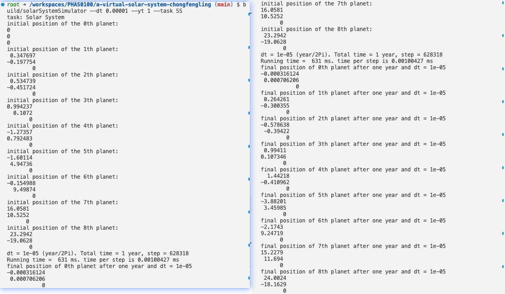
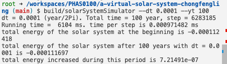
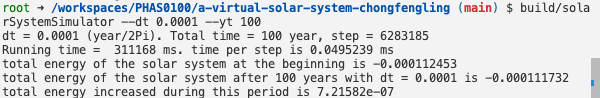
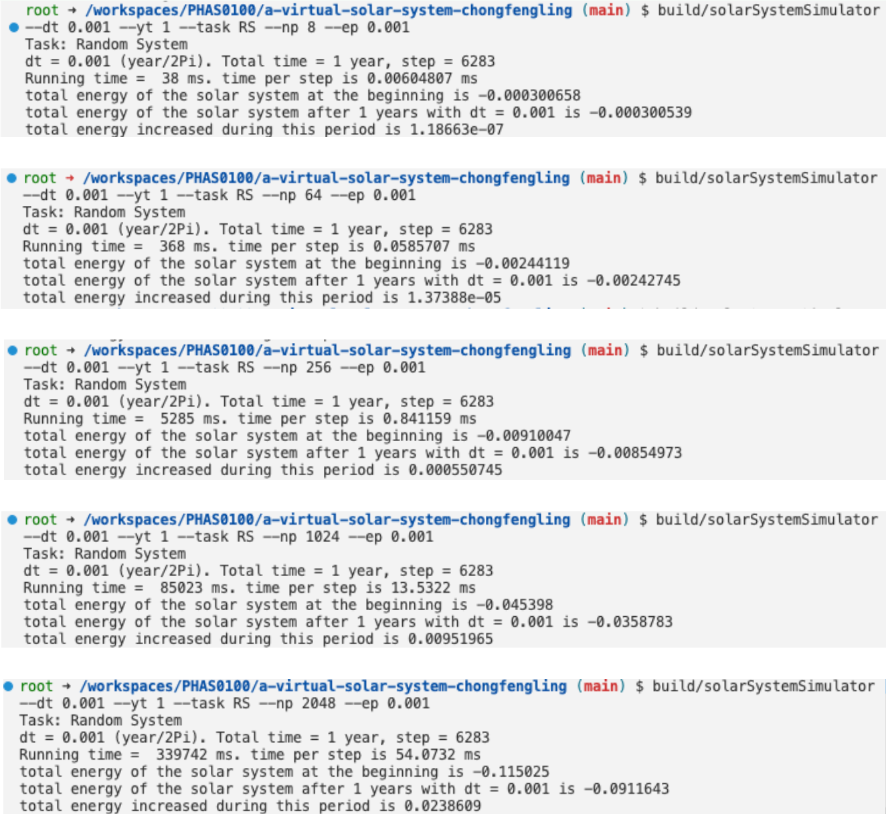
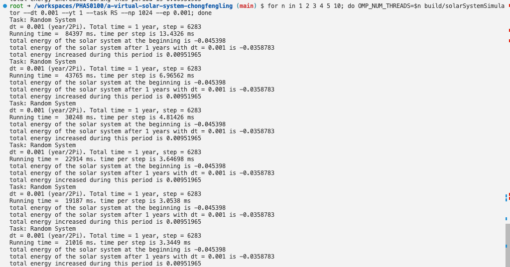

# A Virtual Solar System
This archive contains the finalized individual project completed during the 2022-2023 session of the "[Research Computing with C++](https://www.ucl.ac.uk/module-catalogue/modules/research-computing-with-c-COMP0210)" module.

---

This is the starting repository for assignment 2 of PHAS0100: Research Computing with C++. You may add or remove C++ files in any directory. You should organise the files as you see fit but do read the Folder Structure section below to understand the intended use of the existing folders.

## Installing dependencies

We are using the package manager Conan to install the dependencies Catch2 and Eigen. In order to use CMake's `Release` target for performance and `Debug` for debugging, the libraries must be installed twice with:

```
conan install . --output-folder=build --build=missing -s build_type=Debug
conan install . --output-folder=build --build=missing -s build_type=Release
```

If you delete the `build` directory to clean your build, you may have to install the dependencies again.

## Building

To build from the project root directory you should run:

```
cmake -S . -B build -DCMAKE_BUILD_TYPE=Release
cmake --build build
```

If you wish to debug your code, you should replace `Release` with `Debug`. For performance measurements, ensure you have built with the `Release` target.

## Testing

Once the project has been built, it can be tested by running:

```
cd build
ctest
```

## Folder structure

The project is split into four main parts aligning with the folder structure described in [the relevant section in Modern CMake](https://cliutils.gitlab.io/modern-cmake/chapters/basics/structure.html):

- `app/` contains all code implementing the command-line application.
- `lib/` contains all non-app code. Only code in this directory can be accessed by the unit tests.
- `include/` contains all `.hpp` files.
- `test/` contains all unit tests.

You are expected to edit the `CMakeLists.txt` file in each folder to add or remove sources as necessary. For example, if you create a new file `test/particle_test.cpp`, you must add `particle_test.cpp` to the line `add_executable(tests test.cpp)` in `test/CMakeLists.txt`. Please ensure you are comfortable editing these files well before the submission deadline. If you feel you are struggling with the CMake files, please see the Getting Help section of the assignment instructions.

## Usage Instructions
### Build
Use command
```shell
rm -r build
cmake -S . -B build -DCMAKE_BUILD_TYPE=Release
cmake --build build
```
to clean existing build files and build the project in Release mode.
### help message
Refer to the help message for usage instructions by command `./build/solarSystemSimulator --help`
```shell
Solar System
Usage: build/solarSystemSimulator [OPTIONS]

Options:
-h,--help                   Print this help message and exit

--version                   Display program version information and exit

--dt,--delta_time FLOAT:POSITIVE
                            Time step for simulation, unit is year

--yt,--year_time FLOAT:POSITIVE
                            Total time for simulation, unit is year

--ns,--n_steps INT:POSITIVE The number of simulation steps

--ep,--epsilon FLOAT:POSITIVE
                            parameter epsilon for simulation in the random system

--task TEXT                 task to run. (RS: random system, SS: solar system)

--np,--n_particles INT:POSITIVE
                            The number of particles in the system

--sd,--seed INT:POSITIVE    random seed for random initialized system. (default seed: 2023)
```
## Credits

This project is maintained by Dr. Jamie Quinn as part of UCL ARC's course, Research Computing in C++.

## Results
### 1.3 A Simulation of the Solar System in one year
```shell
./build/solarSystemSimulator --task SS --dt 0.00001 --yt 1
```
**Task: Solar System**
- Time step (dt): 1e-05 years/2Pi
- Total time: 1 year
- Step count: 628318
- Running time: 631 ms
- Time per step: 0.00100427 ms

**Initial position of particles:**
- Particle 0 (Sun): 0, 0, 0
- Particle 1 (Mercury): 0.347697, -0.197754, 0
- Particle 2 (Venus): 0.534739, -0.451724, 0
- Particle 3 (Earth): 0.994237, 0.1072, 0
- Particle 4 (Mars): -1.27357, 0.792483, 0
- Particle 5 (Jupiter): -1.60114, 4.94736, 0
- Particle 6 (Saturn): -0.154988, 9.49874, 0
- Particle 7 (Uranus): 16.0581, 10.5252, 0
- Particle 8 (Neptune): 23.2942, -19.0628, 0

**Final position of particles after 1 year with dt=1e-05:**
- Particle 0 (Sun): -0.000316124, 0.000706206, 0
- Particle 1 (Mercury): 0.264261, -0.300355, 0
- Particle 2 (Venus): -0.578638, -0.39422, 0
- Particle 3 (Earth): 0.99411, 0.107346, 0
- Particle 4 (Mars): 1.44218, -0.410962, 0
- Particle 5 (Jupiter): -3.88201, 3.45985, 0
- Particle 6 (Saturn): -2.1743, 9.24719, 0
- Particle 7 (Uranus): 15.2279, 11.694, 0
- Particle 8 (Neptune): 24.0024, -18.1629, 0

**Screenshot**


### 2.2 Benchmarking the simulation
Energy changed and time costed after 100 years of simulation with different time step dt
set `target_compile_options(solarSystemSimulator PUBLIC -O2)` in app/CMakeLists.txt to enable compiler optimization.
#### 2.2.1 With compiler optimization (8 different dt, total time: 100 years, number of step: 200 $\pi$ / dt)
| dt | Running time (ms) | Time per step (ms) | Energy change | Number of step |
| --- | --- | --- | --- | --- |
| 0.01 | 68 | 0.00108227 | 9.92208e-06 | 62831 |
| 0.001 | 612 | 0.000974029 | 2.61235e-06 | 628318 |
|0.0005 | 1251 | 0.000995514 |1.83367e-06 |1256637 |
|0.0001 | 6104 | 0.000971482 | 7.21491e-07 | 6283185 |
|0.00005 | 12485 | 0.000993525 | 4.41891e-07 | 12566370 | 
|0.00001 | 61652 | 0.000981222 | 1.16686e-07| 62831853 |
|0.000005 | 123166 | 0.000980124 | 6.177e-08 | 125663706 |
|0.000001 | 621710 | 0.000989482 | 1.30497e-08 | 628318530 |

**Screenshot (dt=0.0001)**



#### 2.2.2 Without compiler optimization
| dt | Running time (ms) | Time per step (ms) | Energy change | Number of step |
| --- | --- | --- | --- | --- |
| 0.0001 | 311168 | 0.0495239 | 7.21582e-07 | 6283185 |

**Screenshot (dt=0.0001)**



#### 2.2.3 Summary

Given a fixed total time, The running time and energy change are linearly proportional to the time step dt while the running time per step remains constant (around 0.00099 ms). Compiler optimization results in a significant fiftyfold improvement in runtime (reduce from 0.048 ms to 0.001 ms, with dt=0.0001) and don't affect the energy change.

To balance the time efficiency and computational accuracy, I choose dt=0.001 as the time step for further simulation.

### 2.3 Increasing the scale of the system
With dt=0.001 * $\frac{1}{2\pi}$ year and total time is one year, the simulation results of the random initial conditions with different number of particles are shown below. The number of particles 8, 64, 256, 1024, 2048 and set parameter epsilon $\epsilon=0.001$. The seed is 2023.

| Num Particles | dt | Running time (ms) | Time per step (ms) | Energy change |
| --- | --- | --- | --- | --- |
| 8 | 0.001 | 38 | 0.0060481 | 1.186e-07 |
| 64 | 0.001 | 368 | 0.0586707 | 1.373e-05 | 
| 256 | 0.001 | 5285 | 0.841159 | 0.00055 |
| 1024 | 0.001 | 85023 | 13.5322 | 0.00951 |
| 2048 | 0.001 | 339742 | 54.0732 | 0.02386 |



### 2.4 Parallelizing with OpenMP

#### a) collapse and schedule
```cpp
std::vector<std::shared_ptr<Particle>> update_Solar_System(std::vector<std::shared_ptr<Particle>> Solar_System, double dt, double total_time, int n_steps, double epsilon)
{
    auto start_time = std::chrono::high_resolution_clock::now();
    #pragma omp parallel
    for (int n = 0; n < n_steps; n++)
    {
        // update the gravitational acceleration of each body
        #pragma omp for schedule(runtime)
        for (int i = 0; i < Solar_System.size(); i++)
        {
            Solar_System[i]->updateAcceleration(Solar_System, epsilon);
        }
        #pragma omp barrier
        // update the position and velocity of each body
        #pragma omp for schedule(runtime)
        for (int j = 0; j < Solar_System.size(); j++)
        {
            Solar_System[j]->update(dt);
        }
        #pragma omp barrier
    }
    ...
    return Solar_System;
}
```
The loop in function `uodate_Solar_System` is parallelized with OpenMP as its running time is the bottleneck of the whole program as the number of particle increases.

***collapse***: Due to the calculation of the acceleration and the update of the position and velocity are dependent for the system in each step and not in a nest for loop, collapse mechanism is not suitable for this case.

***schedule***: The `schedule(runtime)` is used to let the compiler decide the best schedule for each loop. Each step in a for loop consume the same time, so different schedule mechanism will not affect the running time too much. This conclusion is verified by the following experiments.
```shell
rm -r build
cmake -S . -B build -DCMAKE_BUILD_TYPE=Release
cmake --build build
OMP_SCHEDULE="dynamic, 4" build/solarSystemSimulator --dt 0.001 --yt 1 --task RS --np 8 --ep 0.001
```
`dynamic` can be replaced by `static` and `guided`.

#### b) scaling experiment
`-O2` compiler optimization is used for the following experiments. In our machine we have 5 cores (by command `nproc --all`). All the experiments are run with seed=2023.

##### Hard-scaling experiment

```shell
rm -r build
cmake -S . -B build -DCMAKE_BUILD_TYPE=Release
cmake --build build
for n in 1 2 3 4 5 10;
do OMP_NUM_THREADS=$n build/solarSystemSimulator --dt 0.001 --yt 1 --task RS --np 1024 --ep 0.001;
done
```
| OMP_NUM_THREADS | Time (ms) | Speedup |
| --- | --- | --- |
| 1 | 84397 | 1 |
| 2 | 43765 | 1.88 |
| 3 | 30248 | 2.82 |
| 4 | 22914 | 3.70 |
| 5 | 19187 | 4.31 |
| 10 | 21016 | 4.02 |



**Analysis**:
1. As the number of threads is increased, the time taken for execution generally decreases, and the speedup increases. This indicates that the program is benefiting from parallelism and utilizing the available cores efficiently.
2. The highest speedup is observed with 5 threads (OMP_NUM_THREADS=5), with a speedup of 4.31 and execution time of 19,187 ms.
3. Increasing the number of threads to 10 (OMP_NUM_THREADS=10) seems to have a negative impact on performance. The execution time increases to 21,016 ms, and the speedup drops to 4.02. Perhaps the COU is throttling its speed to control its temperature, or the overhead of creating and managing threads is too high.
4. Another possible reason for the unexpected decreasing with 10 threads is we here only parallelize the part of the program and with more threads, some other parts of the program may be the bottleneck of the whole program.


##### Weak-scaling experiment
```shell
rm -r build
cmake -S . -B build -DCMAKE_BUILD_TYPE=Release
cmake --build build
for i in 1 2 3 4 5 10;
do 
    echo "OMP_NUM_THREADS=$i"
    OMP_NUM_THREADS=$i build/solarSystemSimulator --dt 0.001 --yt 1 --task RS --np $((1024 * i)) --ep 0.001;
done
```
| OMP_NUM_THREADS | Num Particles | Time (ms) | Speedup |
| --- | --- | --- | --- |
| 1 | 1024 | 85791 | 1 |
| 2 | 2048 | 176675 | 0.49 |
| 3 | 3072 | 269939 | 0.32 |
| 4 | 4096 | 369939 | 0.24 |
| 5 | 5120 | 451094 | 0.19 |
| 10 | 10240 | 1843840 | 0.05 |


**Analysis**:
1. As the number of threads is increased, the time taken for execution increases linearly as the performance should scale with the number of particles. That is , though the number of threads is doubled, the number of particles is also doubled, which makes the total work be four times as much as before.

#### c) Energy parallelization
```cpp
double calTotalEnergy(const std::vector<std::shared_ptr<Particle>> &Solar_System)
{
    double total_energy(0);
    #pragma omp parallel for reduction(+:total_energy) schedule(runtime)
    for (int i = 0; i < Solar_System.size(); i++)
    {
        total_energy += (Solar_System[i]->calKineticEnergy() + Solar_System[i]->calPotentialEnergy(Solar_System));
    }
    return total_energy;
}
```

